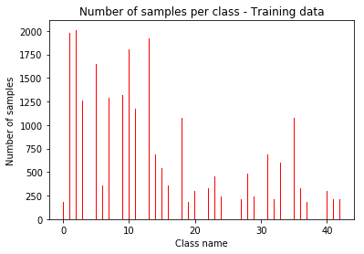
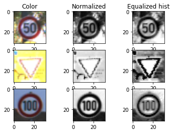
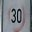

# Traffic Sign Recognition

## Project Writeup

**Build a Traffic Sign Recognition Project**

The goals / steps of this project are the following:
* Load the data set (see below for links to the project data set)
* Explore, summarize and visualize the data set
* Design, train and test a model architecture
* Use the model to make predictions on new images
* Analyze the softmax probabilities of the new images
* Summarize the results with a written report

## Rubric Points

Here I will consider the [rubric points](https://review.udacity.com/#!/rubrics/481/view) individually and describe how I addressed each point in my implementation.  

---

## Writeup / README

### Data Set Summary & Exploration

#### 1. Provide a basic summary of the data set. 

In the code, the analysis was done using python and numpy methods.
I used the numpy library to calculate summary statistics of the traffic
signs data set:

* The size of training set is **34799** images
* The size of the validation set is **4410** images
* The size of test set is **12630** images
* The shape of a traffic sign image is **32px by 32px, 3 channels (R,G,B)**
* The number of unique classes/labels in the data set is **43**

A dictionary of all the class names was generated in this step.

#### 2. Include an exploratory visualization of the dataset.

Here is an exploratory visualization of the data set. 
It is a bar chart showing how the images are distributed across classes.

We can clearly see that the dataset does not have an uniform distribution - the number of images per class differs. 
This means that we may encounter worse prediction results for more rare classes compared to more frequently seen ones, 
as the network will be slightly biased and more confident to predict some of the frequently seen image classes.

### Design and Test a Model Architecture

#### 1. Image data preprocessing. What techniques were chosen and why
Traffic signs in real life are most easily distinguishable by their shape (category) and the images or symbols 
found on them. 

Since the majority of signs sport a white background and black/red/blue/yellow symbols/marks, I decided 
to strip the colour information from each image and work with grayscale images, since I reckon that the sign's shape and 
symbol shape is far more important (if not crucial) to recognizing the sign compared to colour.

My preprocessing pipeline makes use of numpy and skimage functions. I equalize each image's histogram to fix 
brightness and contrast issues, and to put emphasis on each sign's edges, as I believe they are crucial for good results, 
as I expected the convolutional filters to pick some of them up.

Here is an example of 3 traffic sign images before and after the preprocessing step.

While working on the project I was also considering an alternative preprocessing technique which only normalized each image by 
subtracting the mean from each grayscaled pixel, then dividing by the standard deviation. 

You can see a comparison in the preprocessed image output in the figure above. My reasoning was that the shapes and overall 
image look is better after histogram equalization compared to mean normalization, so I sticked with that. Also, the signs' edges 
and shapes/digits/letters were far more legible using this method, for what it's worth.

#### 2. Final model architecture looks like including model type, layers, layer sizes, connectivity, etc.) Consider including a diagram and/or table describing the final model.

My final model consisted of the following layers:

| Layer         		| Description	        					    | 
|:---------------------:|:---------------------------------------------:| 
| Input         		| 32x32x1 grayscale images, normalized          |
| Convolution 5x5     	| 1x1 stride, valid padding, outputs 28x28x6	|
| RELU					|												|
| Max pooling	      	| 2x2 stride,  outputs 14x14x6 			    	|
| Convolution 5x5     	| 1x1 stride, valid padding, outputs 10x10x16	|
| RELU					|												|
| Max pooling	      	| 2x2 stride,  outputs  5x5x16 				    |
| Flatten       	    | outputs 400  									|
| RELU					|												|
| Dropouts              |                                               |
| Fully connected		| outputs 120        							|
| RELU					|												|
| Fully connected		| outputs 84        							|
| RELU					|												|
| Dropouts				|												|
| Logits        		| outputs 43 class predictions					|

#### 3. Describe how you trained your model. The discussion can include the type of optimizer, the batch size, number of epochs and any hyperparameters such as learning rate.

To train the model, I used the Adam optimizer for optimizing 25 epochs and batch size of 256 images. Learning rate: 0.001

#### 4. Describe the approach taken for finding a solution and getting the validation set accuracy to be at least 0.93. Include in the discussion the results on the training, validation and test sets and where in the code these were calculated. Your approach may have been an iterative process, in which case, outline the steps you took to get to the final solution and why you chose those steps. Perhaps your solution involved an already well known implementation or architecture. In this case, discuss why you think the architecture is suitable for the current problem.

It took  *312.8309726715088 seconds* to train the network on my Laptop's i7-6820HQ.

My final model results were:
* training set accuracy of **0.985**
* validation set accuracy of **0.947**
* test set accuracy of **0.921** 

I chose to use LeNet's model architecture as a baseline and work from there.
I chose LeNet due to its simplicity and good results in its base form, 
which was thoroughly tested in a previous lab. On the other hand, because it was simple, 
the architecture left a lot of room for creativity, improvement and testing.

All in all, I chose an architecture that I could easily play with and gain hands-on experience 
fiddling with parameters, filters and additional layers. This certainly came with drawbacks, 
like the lack of refined convolutional layers and topology found in other, more advanced networks 
(like GoogLeNet or Sermanet and LeCun's proposed traffic sign classification CNN). Such drawbacks 
must be taken into account when comparing the network's classification performance, which (due to its simplicity) 
may be lower than networks built using more advanced layering, greater depth and other techniques.

I put a lot of emphasis on minimizing (and preventing) overfitting while keeping the architecture 
efficient and simple. Some changes and additions include:
- The input and output layers had to be changed to match the dataset dimensions and 
number of classes, respectively.
- Dropouts were introduced between fully connected layers to add robustness and prevent overfitting.
In my opinion, the dropout layers were the most helpful tool and addition to the architecture, 
as concluded after many long testing and development cycles.
- The batch size and number of epochs were tweaked during training. The final numbers were chosen 
after a lot of experimenting and improvement, as they were providing the best results 
while keeping the training time reasonably short for rapid development. 
- I wanted to be able to train the network for as long as possible, but in the same time 
keep a small difference in accuracy (2-5%) between the test and validation set, thus 
reducing the risk of overfitting.
- The architecture had an appalingly poor accuracy when trained on data which was not normalized prior to training, 
which in turn led to the data preprocessing and grayscaling steps. The poor accuracy had indicated underfitting.

### Testing the Model on New Images

#### 1. Five German traffic signs found on the web

Here are five German traffic signs that I found on the web:

 
 

 

The third and fifth image lack sharpness and contrast respectively, while the fifth one also barely has the red ring around the 30.
The other three images are looking nice enough for me to believe that no problems will emerge.

I also used the pickled test set to finally test the model's ability to generalize on a larger dataset.

#### 2. Discuss and compare the model's predictions on these new traffic signs
 
 compare the results to predicting on the test set. 
 At a minimum, discuss what the predictions were, the accuracy on these new predictions, 
 and compare the accuracy to the accuracy on the test set

Here are the results of the prediction:

| Image			        |     Prediction	        					| 
|:---------------------:|:---------------------------------------------:| 
| Stop Sign      		| Keep Right **(!)**  							| 
| General caution 		| General caution 								|
| Speed limit (80km/h)	| Speed limit (80km/h)							|
| Go straight or left 	| Go straight or left 							|
| Speed limit (30km/h)  | Speed limit (30km/h)      		       		|

Predictions marked with **(!)** are incorrect.

The model was able to correctly guess 4 of the 5 traffic signs, which gives an accuracy of **80%**.
This compares roughly to the accuracy on the test set of **92,1%**, given the small dataset we're testing.
It is very interesting to me how the model gave a good prediction on the blurry and low contrast signs images,
but failed to recognize the stop sign in the corresponding image.

#### 3. Describe how certain the model is when predicting on each of the five new images by looking at the softmax probabilities for each prediction. 

The code for making predictions on my final model is located in the last cell of the Ipython notebook.

For the first image, the model is relatively sure that this is a 'Keep right' sign 
(probability of 0.667), but the image contains a stop sign. This is the only incorrect 
prediction from the five images found on the Internet. It's interesting to me that the 
network has the stop sign predicted as the mere fifth on the list, with very low probability.
This might be due to the fact that there are relatively few stop sign images in the training set.
Agumenting the dataset to balance out large differences in image count among classes may fix this issue,
as discussed in the dataset exploration part in this writeup.

There is one instance (the third image) where the top prediction is given with less than 50% certainty, but it is
still correctly predicted. Although low, the certainty of the first candidate is almost double that of 
the second candidate's, which means that the model is differentiating well enough among (in this particular case) 
similarly looking signs. 

The other three examples given here show that the model is extremely certain of its prediction, 
with the second candidates having a predicted certainty of less than a 1% of the first prediction. 
This clearly shows that the model is confidently classifying images in the most part, especially 
for those classes which contain many examples in the training set.

The top five soft max probabilities for each image are given in the corresponding 
tables below.

**First image (Stop sign)**
          

| Probability         	|     Prediction	        					| 
|:---------------------:|:---------------------------------------------:| 
| .667         			| Keep right   									| 
| .170     				| No entry 										|
| .112					| Bumpy road									|
| .02685	      		| Traffic signals					 			|
| .02269			    | Stop      						        	|

---

 
**Second image (General caution)**
          
| Probability         	|     Prediction	        					| 
|:---------------------:|:---------------------------------------------:| 
| .997         			| General caution								| 
| .00143     			| Traffic signals 								|
| .00137				| Pedestrians									|
| .0000852	      		| Road narrows on the right		 				|
| .000000005		    | Bicycles crossing      						|

---

 
**Third image (80 km/h)**

| Probability         	|     Prediction	        					| 
|:---------------------:|:---------------------------------------------:| 
| .449         			| Speed limit (80km/h)       					| 
| .268     				| Speed limit (60km/h) 							|
| .119					| End of speed limit (80km/h)					|
| .087	      			| Go straight or right					 		|
| .034				    | End of all speed and passing limits    		|

---

 
**Fourth image (Go straight or left)**

| Probability          	|     Prediction	        					| 
|:---------------------:|:---------------------------------------------:| 
| .999         			| Go straight or left       					| 
| .0005     			| Roundabout mandatory 							|
| .0001 				| No passing for vehicles over 3.5 metric tons	|
| .000098	      		| Turn right ahead					 			|
| .0000008		   	    | Priority road      			    			|

---

 
**Fifth image (30 km/h)**
          
| Probability         	|     Prediction	        					| 
|:---------------------:|:---------------------------------------------:| 
| .999         			| Speed limit (30km/h)       					| 
| .0000067     			| Speed limit (50km/h) 							|
| .0000064				| Speed limit (20km/h)							|
| .0000000002	      	| Wild animals crossing				 			|
| .000000000001		    | Speed limit (70km/h)      					|
